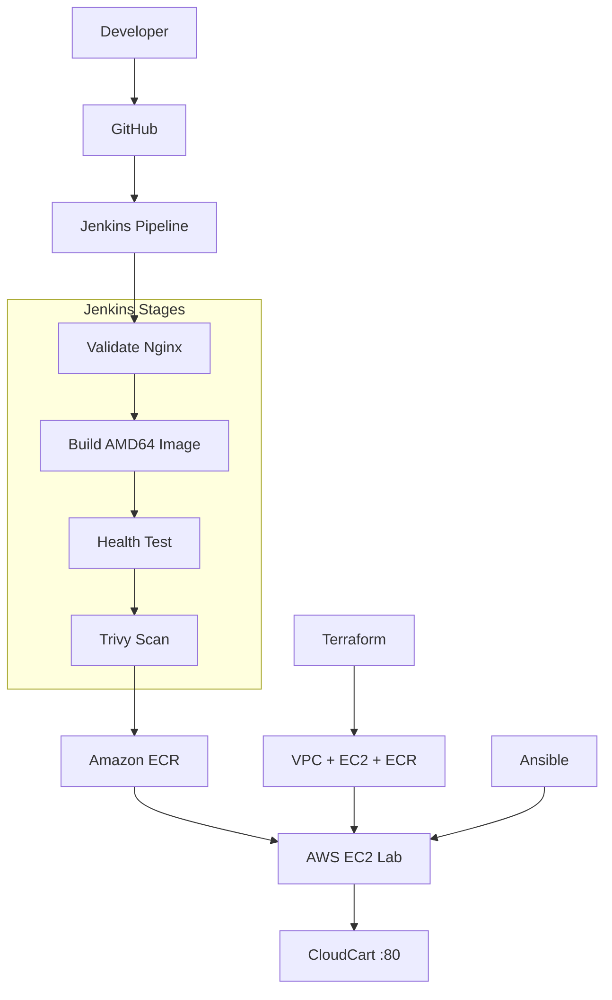
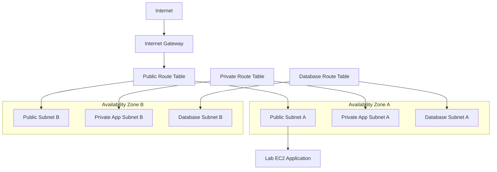
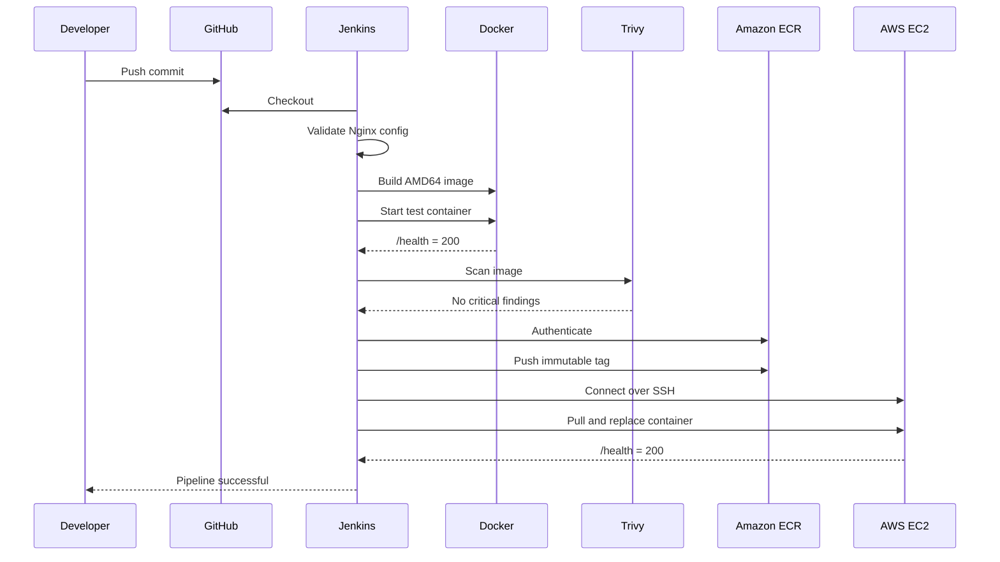
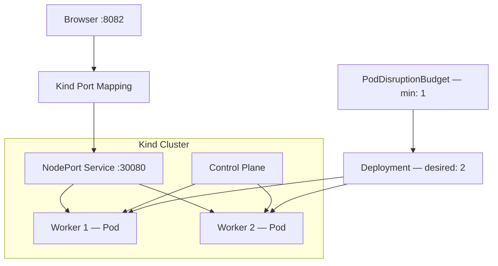
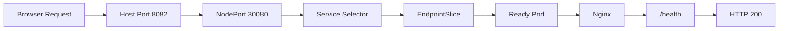
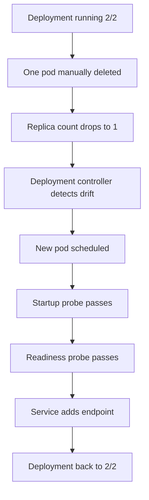
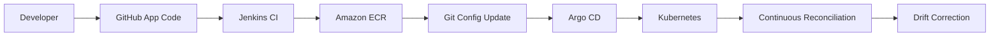
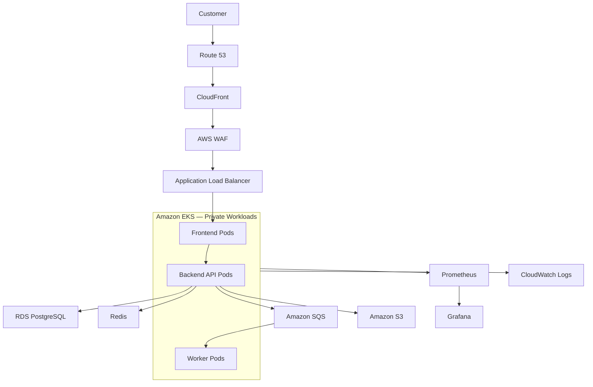

<div align="center">

# 🛒 CloudCart — Production-Style DevOps Platform

### Turning a placeholder container into a cost-controlled, automated, self-healing delivery platform

**One-line value:** CloudCart proves, end to end, that I can take an application from source code to a monitored, self-healing, security-gated deployment — using the same tools and patterns real engineering teams use.

[](https://aws.amazon.com/)
[](https://developer.hashicorp.com/terraform)
[](https://www.ansible.com/)
[](https://www.jenkins.io/)
[](https://www.docker.com/)
[](https://kubernetes.io/)
[](https://aws.amazon.com/ecr/)
[](https://trivy.dev/)

[](#current-status)
[](#implementation-roadmap)
[](#phase-8--helm-packaging-detailed-plan)
[](#cost-control-decisions)
[](https://github.com/anshu-sharma-devops/cloudcart-production-devops-platform/actions/workflows/quality-checks.yml)

**[Executive Summary](#executive-summary) · [What I Built](#what-i-built) · [Architecture](#architecture-overview) · [Kubernetes](#kubernetes-architecture) · [Run It](#docker-quick-start) · [Roadmap](#implementation-roadmap) · [Evidence](#project-evidence) · [Security](#security-controls)**

</div>

---

## Project Snapshot

| Category | Current state |
|---|---|
| Project type | Production-style DevOps portfolio platform |
| Completed milestone | Phase 7 — Kubernetes foundation |
| Next milestone | Phase 8 — Helm packaging |
| AWS environment | Cost-controlled EC2 + ECR lab (`ap-south-1`) |
| Kubernetes environment | Local three-node **Kind** cluster (not EKS) |
| CI/CD | Jenkins pipeline — checkout → build → scan → deploy, completed |
| Application workload | Nginx placeholder |
| Current replicas | Two, spread across two worker nodes |
| Self-healing | Verified by manual pod deletion |
| Full e-commerce application | Planned — Phase 14 |

> CloudCart is a portfolio and learning project. It follows production-grade *patterns* — IaC, least privilege, immutable artifacts, health-gated deployment, self-healing — but it is not a live commercial system. Real production adoption would additionally require organization-specific security review, load testing, managed data stores, alerting and long-term operational history.

---

## Executive Summary

CloudCart simulates a growing e-commerce company that needs to ship changes safely and repeatably. Rather than building the full storefront first, this project builds the **delivery platform** first: the infrastructure, automation, security gates and orchestration that any real application would run on top of.

Today, that platform provisions AWS networking and compute with Terraform, configures servers with Ansible, builds and scans container images, stores them in a private registry, deploys them through a Jenkins pipeline, and runs the workload on Kubernetes with health checks, resource limits and automatic recovery. The current application is intentionally a lightweight Nginx placeholder so the platform itself can be demonstrated cleanly before a real frontend, API and database are layered on top in Phase 14.

Seven phases are complete and verified. Phase 8, packaging the Kubernetes manifests as a Helm chart, is next.

---

## Business Problem

A growing company needs more than a working web page — it needs confidence in the system around the application:

- Can infrastructure be recreated consistently, without manual clicking?
- Can a server be configured the same way every time?
- Is every release built, tested and scanned before it reaches a server?
- Can a bad image be blocked automatically?
- Can a failed pod or container be detected and replaced without a human paging in?
- Can engineers see what's running, and why something failed, quickly?
- Can AWS spend and credentials be controlled?

CloudCart demonstrates answers to each of these questions with working code, not slides.

---

## Why This Project Matters

Most portfolio projects show *an app*. CloudCart shows *the machinery that ships an app safely* — the part hiring managers actually want to see evidence of in a DevOps or platform engineering candidate. Every phase produces a verifiable artifact: a Terraform plan, a Jenkins pipeline log, a Trivy scan result, a `kubectl get pods` output showing self-healing. The project is deliberately staged so incomplete work is never disguised as finished work.

---

## What I Built

- **Infrastructure as Code:** reusable Terraform modules for a multi-AZ VPC, EC2 compute, and ECR.
- **Configuration automation:** Ansible roles that install Docker, AWS CLI and deploy the application idempotently.
- **Secure container registry:** immutable, scanned, encrypted image storage in Amazon ECR.
- **CI/CD pipeline:** a Jenkins pipeline-as-code that validates, builds, tests, scans, publishes and deploys — with a hard security gate.
- **Kubernetes platform:** a three-node local Kind cluster running two replicas with health probes, resource limits, topology spreading, a Service, and a Pod Disruption Budget.
- **Verified self-healing:** manually deleted a pod and confirmed Kubernetes restored the desired state automatically.
- **Documentation discipline:** troubleshooting notes, evidence, and an explicit roadmap separating what's done from what's planned.

---

## Key Engineering Achievements

| Achievement | Why it matters |
|---|---|
| Multi-AZ, multi-tier VPC via reusable Terraform modules | Mirrors how real teams separate public, application and database layers and design for AZ failure |
| IAM instance role instead of AWS keys on EC2 | Removes long-lived credentials from the server entirely |
| Encrypted GP3 volume, SSH restricted to a `/32` | Reduces the attack surface of the only exposed lab host |
| Immutable ECR tags + scan-on-push | Guarantees a deployed image can never be silently overwritten |
| Trivy critical-vulnerability gate in Jenkins | Blocks known-bad images before they ever reach a server |
| AMD64-targeted builds from an ARM dev machine | Solved a real architecture-mismatch failure class before deployment |
| Health-gated deployment (`/health` checked post-deploy) | Deployment is only considered successful if the app actually responds |
| Startup/readiness/liveness probes + resource limits | Kubernetes only routes traffic to pods that are actually ready |
| `maxUnavailable: 0` rolling update strategy | The Deployment is *configured* for zero-downtime rollout (not load-tested or proven under traffic) |
| Topology spread constraints | Prevents both replicas from landing on the same node |
| Pod Disruption Budget (`minAvailable: 1`) | Protects availability during voluntary disruptions |
| Verified pod self-healing | Demonstrated, not assumed — deleted a pod and watched the Deployment recover to `2/2` |

---

## Architecture Overview

### 1 · Project Evolution — *Implemented phases 1–7, remainder planned*


Green = completed and verified. Blue = next (Phase 8). Grey = planned.

### 2 · Current Implemented Platform — *Implemented*



### 3 · AWS VPC — *Implemented*



VPC `10.10.0.0/16` across two Availability Zones. No NAT Gateway is deployed in the lab — private and database subnets exist as reserved tiers for the future application phase, and this keeps the lab within Free Tier–conscious spend.

### 4 · Jenkins Delivery Sequence — *Implemented*



### 5 · Current Kubernetes Architecture — *Implemented, lab-scale*



Two replicas run on two worker nodes with topology spreading, resource requests/limits, a restricted security context (`NET_BIND_SERVICE` added back for Nginx), and startup/readiness/liveness probes.

### 6 · Kubernetes Request Flow — *Implemented*



This flow is why a misconfigured Service `targetPort` matters: when the target port couldn't resolve to a container port, the EndpointSlice came back with an unset port and the Service silently had nowhere to send traffic. See [Problems Solved](#problems-solved-and-lessons-learned).

### 7 · Kubernetes Self-Healing — *Verified test, not a passive claim*



### 8 · Current Lab vs. Future Production Reference

| Layer | Current lab (running) | Future production reference (planned) |
|---|---|---|
| Source control | GitHub | GitHub |
| CI/CD | Local Jenkins | Jenkins + Argo CD |
| Registry | Amazon ECR | Amazon ECR |
| Compute | Single public EC2 instance | Private EKS worker nodes |
| Ingress | Direct port 80 on EC2 | CloudFront → WAF → ALB |
| Orchestration | Local Kind (3 nodes) | Managed EKS |
| Data | None yet | RDS PostgreSQL, Redis, SQS, S3 |
| Observability | Manual `kubectl`/logs | Prometheus, Grafana, CloudWatch |

> The right-hand column is a design target only. Nothing in that column is currently deployed.

### 9 · Future GitOps Workflow — *Planned*



### 10 · Future Production Reference Architecture — *Planned, not deployed*



---

## Technology Decisions

| Area | Technology | Why chosen |
|---|---|---|
| Cloud | AWS (`ap-south-1`) | Widely used provider; realistic IAM, networking and cost model |
| Infrastructure | Terraform | Reviewable, versioned, reusable infrastructure modules |
| Configuration | Ansible | Idempotent server configuration without bespoke shell scripts |
| Containers | Docker | Consistent runtime across laptop, CI and servers |
| Registry | Amazon ECR | Private, encrypted, immutable, scanned image storage |
| CI/CD | Jenkins | Pipeline-as-code with fine-grained credential handling |
| Security scanning | Trivy | Free, fast, blocks critical CVEs before deployment |
| Orchestration | Kubernetes | Declarative desired state, self-healing, service discovery |
| Local cluster | Kind | Free, reproducible multi-node cluster without cloud spend |
| Packaging (next) | Helm | Parameterized, versioned releases with rollback |
| GitOps (planned) | Argo CD | Git as the single source of truth for desired state |
| Metrics (planned) | Prometheus | Standard Kubernetes-native metrics collection |
| Dashboards (planned) | Grafana | Visualization and alerting on top of Prometheus |

---

## Completed vs. Planned Matrix

| Phase | Area | Demonstrated outcome | Status |
|---:|---|---|:---:|
| 1 | Docker | Healthy local workload with `/health` | ✅ |
| 2 | Terraform networking | Multi-AZ, multi-tier VPC | ✅ |
| 3 | AWS compute | Secure, IAM-rooted EC2 lab | ✅ |
| 4 | Ansible | Repeatable server configuration | ✅ |
| 5 | ECR | Immutable, scanned, versioned images | ✅ |
| 6 | Jenkins | Automated, security-gated delivery | ✅ |
| 7 | Kubernetes | Two replicas, verified self-healing | ✅ |
| 8 | Helm | Reusable releases, rollback | ▶️ Next |
| 9 | GitOps | Argo CD reconciliation | 🗓️ Planned |
| 10 | Observability | Prometheus, Grafana, alerting | 🗓️ Planned |
| 11 | Security automation | Gitleaks, Checkov, policy scanning | 🗓️ Planned |
| 12 | Reliability | HPA, load and recovery testing | 🗓️ Planned |
| 13 | EKS | Temporary AWS reference deployment | 🗓️ Planned |
| 14 | Application | Frontend, API, database | 🗓️ Planned |
| 15 | Portfolio | Final runbooks and demonstration | 🗓️ Planned |

```mermaid
flowchart LR
    P1["1 Docker"]:::done --> P2["2 VPC"]:::done --> P3["3 EC2"]:::done --> P4["4 Ansible"]:::done --> P5["5 ECR"]:::done
    P5 --> P6["6 Jenkins"]:::done --> P7["7 Kubernetes"]:::done --> P8["8 Helm"]:::next --> P9["9 GitOps"]:::planned --> P10["10 Observability"]:::planned
    P10 --> P11["11 Security"]:::planned --> P12["12 Reliability"]:::planned --> P13["13 EKS"]:::planned --> P14["14 App"]:::planned --> P15["15 Portfolio"]:::planned

    classDef done fill:#22C55E,stroke:#15803D,color:#052e16
    classDef next fill:#0F1689,stroke:#0F1689,color:#ffffff
    classDef planned fill:#E5E7EB,stroke:#9CA3AF,color:#111827
```



---

## Repository Structure

```text
cloudcart-production-devops-platform/
├── ansible/                # Inventory, playbooks, roles
├── application/placeholder/ # Dockerfile, index.html, nginx.conf
├── architecture/            # Diagrams and design notes
├── argocd/                  # GitOps definitions (Phase 9, planned)
├── docker/
├── helm/                    # Chart in progress — Phase 8
├── infrastructure/
│   ├── environments/{lab,dev,staging,production}/
│   └── modules/{vpc,ec2,ecr}/
├── jenkins/Jenkinsfile      # Pipeline as code
├── kubernetes/{base,kind,overlays}/
├── monitoring/{grafana,prometheus}/  # Planned — Phase 10
├── runbooks/
├── screenshots/
├── security/
├── compose.yaml
├── README.md
└── TROUBLESHOOTING.md
```

| Directory | Responsibility |
|---|---|
| `application/` | Nginx placeholder source, Dockerfile, config |
| `infrastructure/` | Terraform modules and environment roots |
| `ansible/` | Server configuration roles and playbooks |
| `jenkins/` | Pipeline-as-code definition |
| `kubernetes/` | Kind config, base manifests, overlays |
| `helm/` | Reusable chart (Phase 8, in progress) |
| `argocd/` | GitOps Application definitions (planned) |
| `monitoring/` | Prometheus and Grafana configuration (planned) |
| `security/` | Scan configuration and evidence |
| `runbooks/` | Operational and recovery procedures |
| `screenshots/` | Visual evidence per phase |

---

## Prerequisites

- Git, Docker Desktop with Compose
- `kubectl`, Kind
- AWS CLI, Terraform, Ansible (for the AWS phases)
- Jenkins and Trivy (for the CI/CD phase)

```bash
git clone https://github.com/anshu-sharma-devops/cloudcart-production-devops-platform.git
cd cloudcart-production-devops-platform
```

---

## Docker Quick Start

```bash
docker compose up -d --build
docker compose ps
curl -i http://localhost:8081/health
```

Open `http://localhost:8081`. Stop with `docker compose down`.

---

## Kubernetes Quick Start

<details>
<summary>Full Kind cluster walkthrough</summary>

```bash
kind create cluster \
  --name cloudcart \
  --config kubernetes/kind/cluster-config.yaml

docker build -t cloudcart-placeholder:k8s-v1 application/placeholder
kind load docker-image cloudcart-placeholder:k8s-v1 --name cloudcart

kubectl apply -k kubernetes/base
kubectl rollout status deployment/cloudcart -n cloudcart --timeout=180s
```

Verify:

```bash
kubectl get nodes -o wide
kubectl get pods -n cloudcart -o wide
kubectl get deployment,service,pdb -n cloudcart
kubectl get endpointslice -n cloudcart -l kubernetes.io/service-name=cloudcart -o wide
curl -i http://localhost:8082/health
```

Open `http://localhost:8082`. Tear down with:

```bash
kind delete cluster --name cloudcart
```

</details>

### Self-Healing Demonstration

```bash
POD_TO_DELETE=$(kubectl get pods -n cloudcart -o jsonpath='{.items[0].metadata.name}')
kubectl delete pod "$POD_TO_DELETE" -n cloudcart
kubectl get pods -n cloudcart --watch
```

The Deployment recreates the pod automatically and returns to `2/2` available replicas once probes pass.

---

## AWS Deployment Explanation

AWS resources are created via Terraform modules (`vpc`, `ec2`, `ecr`) and configured via Ansible. Never hard-code live identifiers — use Terraform outputs:

```bash
terraform output -raw app_public_ip
terraform output -raw ecr_repository_url
```

The Jenkins pipeline then builds an AMD64 image, tests it locally, scans it with Trivy, pushes the versioned tag to ECR, and deploys to EC2 over SSH using credentials stored in Jenkins — never in the Jenkinsfile itself.

---

## Security Controls

- No AWS credentials, SSH private keys, or Terraform state committed to Git
- EC2 uses an IAM instance role instead of static AWS keys
- SSH ingress restricted to an administrator `/32` CIDR
- EBS volumes encrypted; ECR uses AES-256 encryption
- ECR tags immutable; images scanned on push
- Trivy blocks critical vulnerabilities in CI before deployment
- Jenkins credentials stored in Jenkins, not in pipeline code
- Kubernetes routes traffic only to pods passing readiness probes
- Containers run with a restricted security context and minimal added capabilities

Never commit:

```text
*.pem
*.tfstate
*.tfstate.*
*.tfplan
terraform.tfvars
.env
AWS access keys
Jenkins secrets
Private inventory containing sensitive values
```

Pre-push check:

```bash
git status --short
git diff --cached
find . -type f -name "*.pem"
```

---

## Cost-Control Decisions

This project is **Free Tier–conscious**, not guaranteed free — AWS pricing depends on account age, region and usage.

- No NAT Gateway in the lab
- Small EC2 instance type and small encrypted GP3 volume
- Local Jenkins instead of a continuously running Jenkins EC2 host
- Local Kind instead of a continuously running EKS cluster
- ECR lifecycle policy to limit stored image versions
- Project and cost-centre tags on all resources
- EC2 stopped when not actively in use
- Temporary resources (e.g., a future EKS reference) destroyed immediately after evidence is captured
- `terraform plan` reviewed before every `apply`

> Public IPv4 addresses, EKS, NAT Gateway, load balancers, RDS, WAF and other managed services can generate charges. Always check AWS Billing and Cost Explorer before and after any hands-on session.

---

## Problems Solved and Lessons Learned

| Failure | Root cause | Resolution | Lesson |
|---|---|---|---|
| Docker daemon not running | Docker Desktop not started before pipeline run | Started Docker Desktop, added a pre-flight check | Fail fast with clear pre-checks |
| Jenkins port conflict | Jenkins and CloudCart both wanted `8080` | Remapped CloudCart's local port | Reserve ports explicitly per service |
| Nginx marked unhealthy | Health check hit the wrong address inside the container | Corrected the health-check target | Container health checks need container-local addressing |
| Nginx restart loop | Invalid Nginx config syntax | Validated config before container start | Validate configuration before deployment, not after failure |
| Duplicate Terraform variables | Same variable declared in two files | Consolidated into one variables file | Keep a single source of truth per module |
| EC2 module content in VPC module | Copy-paste error while scaffolding | Split resources into correct modules | Module boundaries matter for reuse |
| Terraform run in wrong directory | Ran `apply` from repo root instead of environment folder | Used explicit `-chdir` and README-documented paths | Always confirm working directory for IaC commands |
| `terraform.tfvar` instead of `.tfvars` | Filename typo | Renamed file, Terraform auto-loaded it | Terraform silently ignores misnamed var files |
| Invalid SSH CIDR | Malformed `/32` entry | Corrected CIDR notation | Validate security group inputs before apply |
| Missing SSH key path | Local key path not set before Ansible run | Set and documented the variable | Externalize environment-specific paths |
| Ubuntu 24.04 missing `awscli` package | Package not in default apt repos | Installed AWS CLI v2 via official installer | Don't assume package availability across Ubuntu versions |
| Ansible YAML indentation error | Manual YAML edit broke structure | Linted and corrected indentation | YAML whitespace errors are a common Ansible failure mode |
| Jenkins couldn't reach Docker | Docker socket/daemon not accessible to Jenkins | Fixed Jenkins-Docker integration | CI runners need explicit Docker access configuration |
| Trivy blocked a critical Alpine CVE | Base image had a known critical vulnerability | Updated base image, re-scanned clean | Security gates should block, not just report |
| Stale kubeconfig pointing to a deleted EKS cluster | Old context left active after cleanup | Removed stale context, switched to Kind context | Clean up kubeconfig contexts after tearing down clusters |
| Kubernetes YAML metadata/indentation errors | Manual manifest edits | Used `kubectl apply --dry-run` before applying | Dry-run catches manifest errors before they hit the cluster |
| Nginx couldn't bind to port 80 | Dropped Linux capabilities removed `NET_BIND_SERVICE` | Re-added the specific capability | Restrict capabilities to the minimum actually needed, not zero |
| Service target port unresolved | Named port mismatch between container and Service | Aligned port names between Deployment and Service | Named ports must match exactly across manifests |
| EndpointSlice showed an unset port | Direct consequence of the above target-port mismatch | Fixed after correcting the Service definition | EndpointSlice output is a fast diagnostic for Service misconfiguration |

Full commands and detail live in [`TROUBLESHOOTING.md`](TROUBLESHOOTING.md).

---

## Project Evidence

Screenshots are organized by phase and reference the actual files in the repository's `screenshots/` directory.

### Phase 1 — Docker foundation

| Evidence | Screenshot |
|---|---|
| CloudCart placeholder running locally | `screenshots/01-cloudcart-placeholder-local.png` |
| Docker Compose service healthy | `screenshots/02-docker-compose-service-healthy.png` |
| `/health` endpoint response | `screenshots/03-cloudcart-health-endpoint.png` |

### Phase 2 — Terraform AWS networking

| Evidence | Screenshot |
|---|---|
| `terraform init` success | `screenshots/phase-2/01-terraform-init-success.png` |
| `terraform validate` success | `screenshots/phase-2/02-terraform-validate-success.png` |
| `terraform plan` — no changes on re-run | `screenshots/phase-2/03-terraform-plan-no-changes.png` |
| Managed resources summary | `screenshots/phase-2/04-terraform-managed-resources.png` |
| Terraform outputs | `screenshots/phase-2/05-terraform-outputs.png` |
| VPC created in AWS Console | `screenshots/phase-2/06-aws-vpc-created.png` |
| Public subnets | `screenshots/phase-2/07-public-subnets.png` |
| Private application subnets | `screenshots/phase-2/08-private-app-subnets.png` |
| Database subnets | `screenshots/phase-2/09-database-subnets.png` |
| Internet Gateway | `screenshots/phase-2/10-internet-gateway.png` |
| Route tables | `screenshots/phase-2/11-route-tables.png` |
| Public internet route | `screenshots/phase-2/12-public-internet-route.png` |

### Phase 3 — AWS EC2 compute

| Evidence | Screenshot |
|---|---|
| `terraform plan` for EC2 module | `screenshots/phase-3/01-terraform-phase3-plan.png` |
| Managed resources summary | `screenshots/phase-3/02-terraform-phase3-managed-resources.png` |
| Terraform outputs | `screenshots/phase-3/03-terraform-phase3-outputs.png` |
| EC2 instance running | `screenshots/phase-3/04-cloudcart-ec2-running.png` |
| Security group rules | `screenshots/phase-3/05-cloudcart-security-group.png` |
| Encrypted EBS volume | `screenshots/phase-3/06-encrypted-ebs-volume.png` |
| IAM instance role | `screenshots/phase-3/07-cloudcart-iam-role.png` |
| SSH connection success | `screenshots/phase-3/08-cloudcart-ssh-success.png` |

### Phase 4 — Ansible configuration

| Evidence | Screenshot |
|---|---|
| Ansible ping success | `screenshots/phase-4/01-ansible-ping-success.png` |
| Playbook run success | `screenshots/phase-4/02-ansible-playbook-success.png` |
| Docker service active on EC2 | `screenshots/phase-4/03-docker-service-active.png` |
| CloudCart container healthy | `screenshots/phase-4/04-cloudcart-container-healthy.png` |
| Public health check | `screenshots/phase-4/05-cloudcart-public-health.png` |
| CloudCart reachable on AWS | `screenshots/phase-4/06-cloudcart-aws-website.png` |

### Phase 5 — Amazon ECR

| Evidence | Screenshot |
|---|---|
| `terraform plan` for ECR module | `screenshots/phase-5/01-terraform-ecr-plan.png` |
| Managed resources summary | `screenshots/phase-5/02-terraform-ecr-managed-resources.png` |
| ECR login success | `screenshots/phase-5/03-ecr-login-success.png` |
| Docker image build | `screenshots/phase-5/04-docker-image-build.png` |
| Image push to ECR | `screenshots/phase-5/05-ecr-image-push.png` |
| Image visible in AWS Console | `screenshots/phase-5/06-ecr-image-in-aws-console.png` |
| Repository settings (immutability, scan-on-push) | `screenshots/phase-5/07-ecr-repository-settings.png` |
| Lifecycle policy | `screenshots/phase-5/08-ecr-lifecycle-policy.png` |

### Phase 6 — Jenkins CI/CD

| Evidence | Screenshot |
|---|---|
| Pipeline prerequisite check | `screenshots/phase-6/01-jenkins-prerequisite-check.png` |
| AWS CLI installed on EC2 | `screenshots/phase-6/02-aws-cli-installed-on-ec2.png` |
| EC2 IAM role identity check | `screenshots/phase-6/03-ec2-iam-role-identity.png` |
| EC2 → ECR access verified | `screenshots/phase-6/04-ec2-ecr-access.png` |
| Jenkins credential IDs configured | `screenshots/phase-6/05-jenkins-credential-ids.png` |
| Early pipeline failure — Docker not running | `screenshots/phase-6/06-pipeline-failed-docker-not-running.png` |
| Trivy — critical vulnerabilities detected (gate working) | `screenshots/phase-6/07-trivy-critical-vulnerabilities-detected.png` |
| Trivy — scan passed after remediation | `screenshots/phase-6/08-trivy-security-scan-passed.png` |
| Jenkins pipeline stage view | `screenshots/phase-6/09-jenkins-pipeline-stage-view.png` |
| ECR image push success | `screenshots/phase-6/10-ecr-image-push-success.png` |
| EC2 deployment success | `screenshots/phase-6/11-ec2-deployment-success.png` |
| Jenkins console — pipeline successful | `screenshots/phase-6/12-jenkins-console-success.png` |
| Versioned image (`v1.0.4`) in ECR | `screenshots/phase-6/13-ecr-v1.0.4-image.png` |
| CloudCart live after CI/CD deployment | `screenshots/phase-6/14-cloudcart-after-cicd-deployment.png` |
| Public health verification | `screenshots/phase-6/15-public-health-verification.png` |
| Jenkins credentials masked in logs | `screenshots/phase-6/16-jenkins-credentials-masked.png` |

### Phase 7 — Kubernetes foundation

| Evidence | Screenshot |
|---|---|
| Kind cluster created | `screenshots/phase-7/01-kind-cluster-created.png` |
| Three Ready Kind nodes | `screenshots/phase-7/02-kind-three-nodes-ready.png` |
| CloudCart image loaded into all nodes | `screenshots/phase-7/03-cloudcart-image-loaded-all-nodes.png` |
| Rollout success | `screenshots/phase-7/04-kubernetes-rollout-success.png` |
| Two pods spread across workers | `screenshots/phase-7/05-cloudcart-pods-distributed.png` |
| Deployment, Service, PDB | `screenshots/phase-7/06-kubernetes-resources.png` |
| EndpointSlice output | `screenshots/phase-7/07-cloudcart-endpointslice.png` |
| `/health` endpoint response | `screenshots/phase-7/08-cloudcart-health-endpoint.png` |
| Browser at `localhost:8082` | `screenshots/phase-7/09-cloudcart-kubernetes-browser.png` |
| State immediately before self-healing test | `screenshots/phase-7/10-before-self-healing-test.png` |
| Self-healing in progress | `screenshots/phase-7/11-kubernetes-self-healing.png` |
| Self-healing completed — back to `2/2` | `screenshots/phase-7/12-self-healing-completed.png` |
| Health check after self-healing | `screenshots/phase-7/13-health-after-self-healing.png` |

> No account credentials, access keys, SSH private keys, Jenkins secrets or Terraform state appear in any screenshot.

---

## Implementation Roadmap

| Phase | Milestone | Status |
|---:|---|:---:|
| 1 | Foundation, Docker | ✅ Completed |
| 2 | Terraform AWS networking | ✅ Completed |
| 3 | Secure EC2 compute | ✅ Completed |
| 4 | Ansible configuration | ✅ Completed |
| 5 | Amazon ECR | ✅ Completed |
| 6 | Jenkins CI/CD | ✅ Completed |
| 7 | Kubernetes foundation | ✅ Completed |
| 8 | Helm packaging and rollback | ▶️ Next |
| 9 | Argo CD GitOps | 🗓️ Planned |
| 10 | Prometheus and Grafana | 🗓️ Planned |
| 11 | Security automation | 🗓️ Planned |
| 12 | Reliability and recovery testing | 🗓️ Planned |
| 13 | Temporary AWS EKS reference | 🗓️ Planned |
| 14 | Full CloudCart application | 🗓️ Planned |
| 15 | Portfolio delivery | 🗓️ Planned |

---

## Phase 8 — Helm Packaging (Detailed Plan)

```mermaid
flowchart LR
    Raw["Raw K8s Manifests"] --> Chart["Helm Chart Templates"]
    Chart --> Values["values.yaml"]
    Values --> Env["Environment Values"]
    Env --> Lint["helm lint"]
    Lint --> Tmpl["helm template"]
    Tmpl --> Install["helm install"]
    Install --> Upgrade["helm upgrade"]
    Upgrade --> Hist["helm history"]
    Hist --> Rollback["helm rollback"]
```



Planned work:

- Create `Chart.yaml`, `values.yaml`, and reusable templates
- Parameterize image repository/tag, replica count, ports, probes, resources, security context, topology constraints and the PDB
- Add environment-specific values for lab, dev, staging and production
- Run `helm lint` and `helm template` before install
- Install a named release, perform a version upgrade
- Inspect `helm history` and demonstrate `helm rollback`
- Preserve every Phase 7 guarantee (probes, security context, spreading, disruption protection)
- Capture release and rollback evidence for the portfolio

---

## Known Limitations

- The application is a placeholder — not yet the full CloudCart e-commerce experience
- Kubernetes runs on local Kind, not a continuously running EKS cluster
- Jenkins runs locally, not as a managed always-on service
- The AWS lab EC2 host is internet-facing for learning convenience, not hardened for public production traffic
- No HTTPS, WAF, managed database or centralized observability yet
- Horizontal Pod Autoscaling has not been demonstrated
- Zero-downtime rollout is *configured* (`maxUnavailable: 0`), not load-tested or proven under real traffic
- Backup, restore, load and disaster-recovery testing remain planned
- No real payments or personal customer data are used anywhere in this project

---

## Skills Demonstrated

- Infrastructure as Code with modular, reusable Terraform
- Configuration management and idempotent automation with Ansible
- Container build, test and security scanning workflows
- CI/CD pipeline design with hard security gates
- Kubernetes fundamentals: Deployments, Services, EndpointSlices, PDBs, probes, resource management, topology spreading
- Debugging across Docker, Terraform, AWS, Ansible, Jenkins and Kubernetes
- Cost-conscious cloud practice and credential hygiene
- Clear technical documentation that separates fact from plan

---

## Interview Explanation

> CloudCart is a production-style DevOps platform I'm building from the ground up. I containerized a small Nginx workload, then provisioned a multi-tier AWS network, EC2 compute and ECR with reusable Terraform modules. I automated server configuration with Ansible and built a Jenkins pipeline that validates, builds, tests, scans with Trivy, pushes an immutable image to ECR, and deploys to EC2 with a post-deploy health check. I then stood up a three-node Kind cluster and deployed two replicas with probes, resource limits, rolling updates, topology spreading, a Service and a Pod Disruption Budget — and proved self-healing by deleting a pod and watching Kubernetes restore it. Next I'm packaging the release with Helm, followed by GitOps and monitoring.

---

<div align="center">

## Author

### Anshu Sharma
**Aspiring Cloud and DevOps Engineer**

Building practical systems with AWS, Terraform, Ansible, Jenkins, Docker, Kubernetes, Helm and GitOps.

[](https://github.com/anshu-sharma-devops)

---

**Phases 1–7 completed · Phase 8, Helm packaging, is next**

</div>