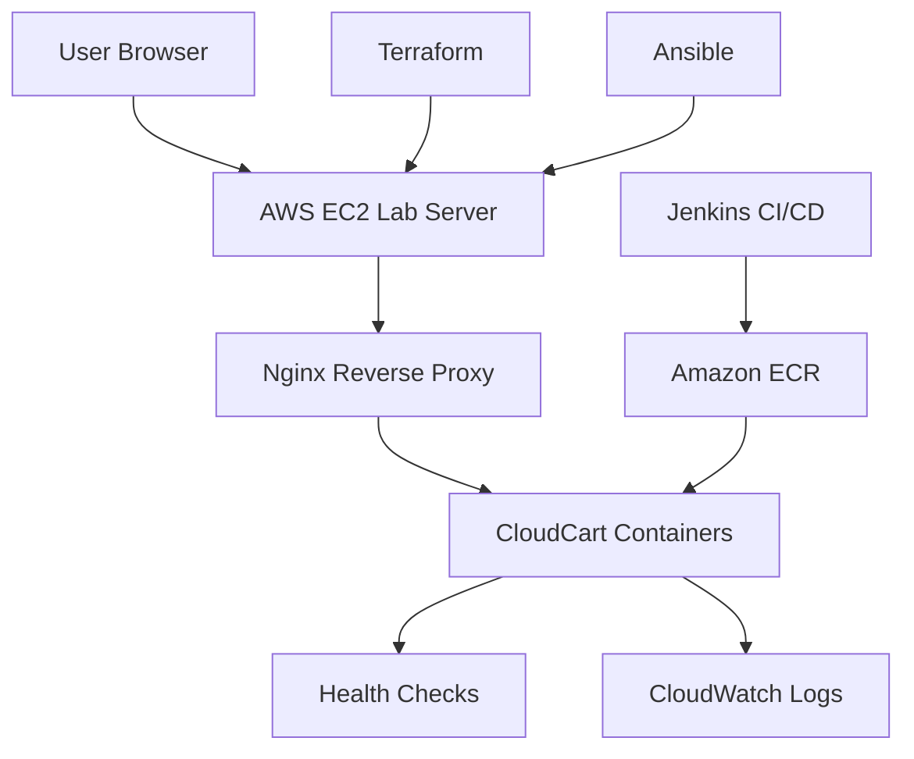
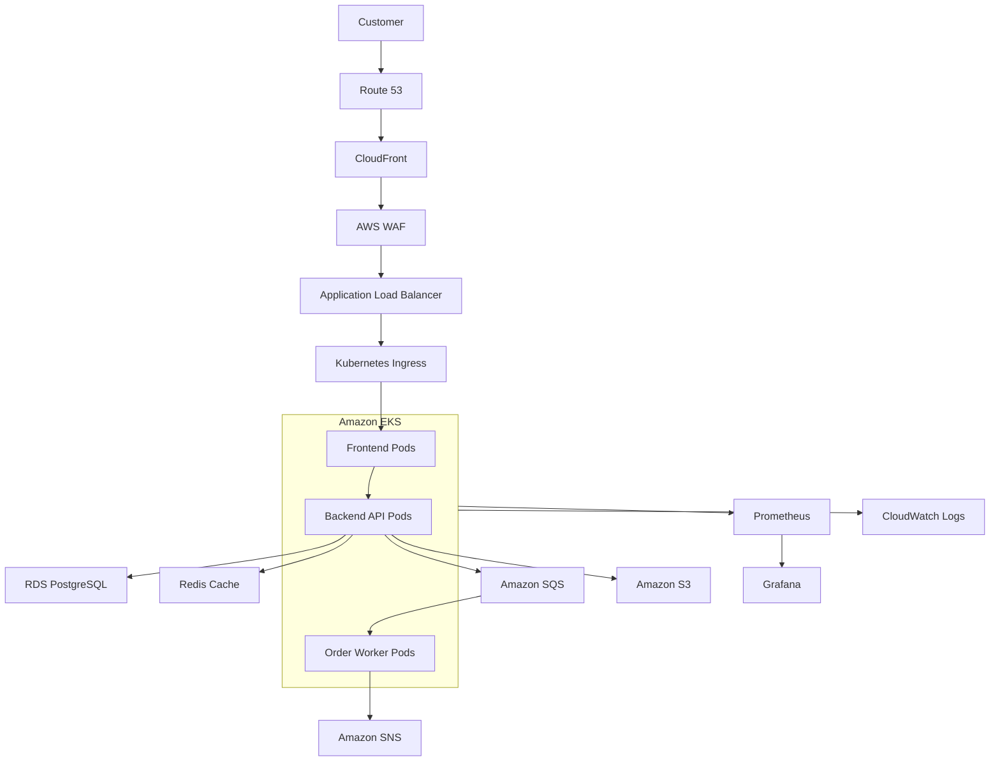
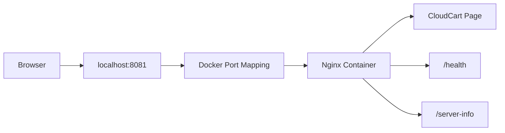
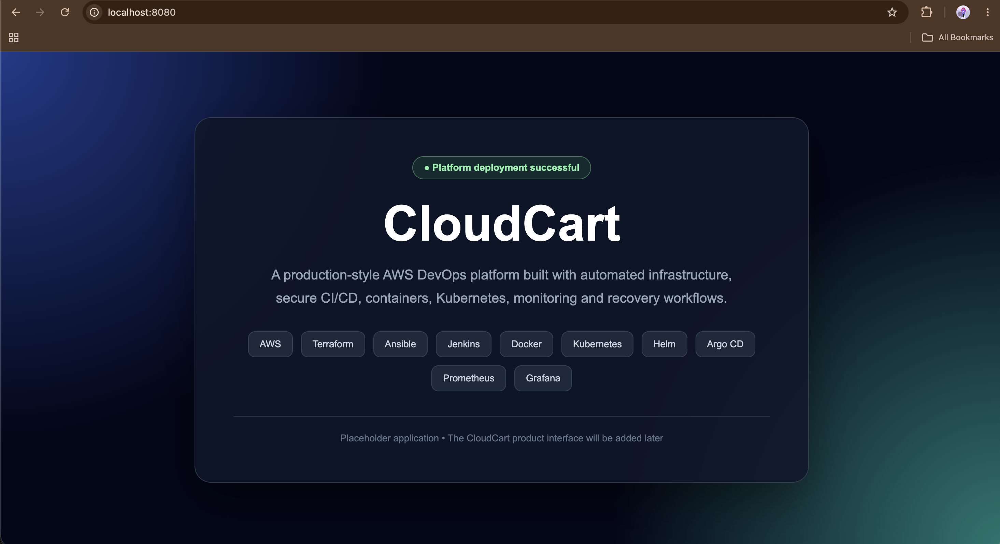
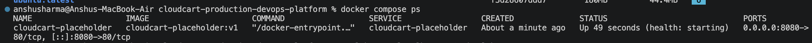
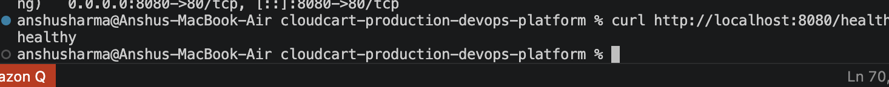

<div align="center">

# 🛒 CloudCart Production DevOps Platform

### A production-style e-commerce platform built on AWS using modern Cloud and DevOps practices

**From local containers to a secure, automated and observable cloud platform**

<br>

[](https://aws.amazon.com/)
[](https://developer.hashicorp.com/terraform)
[](https://www.ansible.com/)
[](https://www.jenkins.io/)
[](https://www.docker.com/)
[](https://kubernetes.io/)
[](https://helm.sh/)
[](https://argo-cd.readthedocs.io/)
[](https://prometheus.io/)
[](https://grafana.com/)

<br>

[](#-where-we-are-now)
[](#-where-we-are-now)
[](#-current-working-environment)
[](#-aws-cost-control-strategy)

<br>

[Project Overview](#-project-overview) •
[Architecture](#-architecture-strategy) •
[Current Status](#-where-we-are-now) •
[Roadmap](#-implementation-roadmap) •
[Run Locally](#-run-the-current-application) •
[Troubleshooting](TROUBLESHOOTING.md)

</div>

---

## 📖 Project Overview

**CloudCart** is a production-style Cloud and DevOps portfolio project that demonstrates how a company application can be designed, provisioned, deployed, secured, monitored and recovered on AWS.

The project will eventually contain a working e-commerce application where customers can browse products, manage a shopping cart, complete a simulated checkout and track orders. Administrators will be able to manage products, inventory and order status.

However, the primary focus of this repository is not advanced frontend or backend development. The main objective is to build the complete engineering platform around the application using:

- Infrastructure as Code
- Configuration management
- Containerization
- CI/CD automation
- Kubernetes orchestration
- GitOps
- Security scanning
- Monitoring and logging
- Scaling and self-healing
- Backup and recovery
- AWS cost control

The project currently uses a lightweight Nginx placeholder application as its workload. This allows the Cloud and DevOps platform to be developed first. The placeholder will later be replaced by the complete CloudCart frontend and backend without rebuilding the entire delivery platform.

---

## 💼 Business Scenario

CloudCart represents a growing e-commerce company that needs a reliable platform for delivering its application.

The company requires an environment that can:

- Deploy application changes consistently
- Reduce manual infrastructure configuration
- Test code before deployment
- Scan code and container images for security issues
- Store versioned container images
- deploy changes across development, staging and production
- Recover automatically from application failures
- Scale when customer traffic increases
- Protect application secrets and customer data
- Monitor technical and business performance
- Roll back failed releases
- Back up and restore important data
- Control AWS costs

This repository documents how that platform evolves from a local container into a production-style AWS environment.

---

## 🎯 Project Objectives

The main objectives are to:

- Create reusable AWS infrastructure using Terraform modules
- Maintain separate lab, development, staging and production configurations
- Configure servers consistently using Ansible
- Package application services as Docker images
- Build CI/CD automation using Jenkins
- Store approved images in Amazon ECR
- Deploy containerized workloads using Kubernetes
- Package Kubernetes resources using Helm
- Implement GitOps deployment using Argo CD
- Scan code, infrastructure and images for vulnerabilities
- Manage secrets without committing them to Git
- Collect application and infrastructure metrics
- Build dashboards using Prometheus and Grafana
- Centralize AWS and application logs
- Demonstrate health checks and automatic recovery
- Demonstrate autoscaling and deployment rollback
- Test backup and restore procedures
- Record errors and fixes in troubleshooting documentation
- Maintain a Free Tier-conscious working environment
- Provide a complete company-style production reference architecture

---

## 🧩 What This Repository Will Contain

| Area | Implementation |
|---|---|
| Application workload | CloudCart frontend, backend API and supporting services |
| Local development | Docker and Docker Compose |
| Cloud provider | Amazon Web Services |
| Infrastructure | Terraform modules and environment configurations |
| Server configuration | Ansible roles and playbooks |
| Continuous integration | Jenkins pipelines |
| Container registry | Amazon ECR |
| Orchestration | Kubernetes and Amazon EKS |
| Kubernetes packaging | Helm |
| GitOps | Argo CD |
| Metrics | Prometheus |
| Dashboards | Grafana |
| AWS monitoring | Amazon CloudWatch |
| Security scanning | Trivy, Checkov and Gitleaks |
| Secrets | AWS Secrets Manager and secure environment configuration |
| Documentation | README files, architecture diagrams and runbooks |
| Evidence | Screenshots, test results and troubleshooting records |

---

## 🏗️ Architecture Strategy

CloudCart will contain two infrastructure profiles:

1. A cost-controlled working environment
2. A company-style production reference environment

This allows the project to demonstrate production engineering practices without keeping expensive AWS services active continuously.

### Cost-Controlled Lab Architecture

The lab profile is the version that will be deployed and tested regularly.



The initial lab environment will prioritize:

- Small AWS resources
- Simple networking
- No NAT Gateway
- Temporary cloud deployments
- Automated cleanup
- Reusable infrastructure code
- Clear documentation of production differences

### Production Reference Architecture

The production profile demonstrates how CloudCart could operate in a company environment.



The production reference will include:

- Multiple Availability Zones
- Public load-balancer subnets
- Private application subnets
- Isolated database subnets
- Amazon EKS
- Multiple application replicas
- Amazon ECR
- RDS PostgreSQL
- Redis caching
- SQS event processing
- S3 object storage
- HTTPS
- AWS WAF
- Secrets management
- Monitoring and alerting
- Automated scaling
- Backup and recovery
- Deployment rollback

Some of these services generate charges and will only be deployed temporarily when required.

---

## 🔄 Application Delivery Flow

The final application-delivery workflow will be:

```mermaid
flowchart LR
    Developer["Developer"] --> GitHub["GitHub"]
    GitHub --> Jenkins["Jenkins CI"]
    Jenkins --> Test["Test and Validate"]
    Test --> Scan["Security Scan"]
    Scan --> Build["Build Docker Image"]
    Build --> ECR["Amazon ECR"]
    ECR --> GitOps["GitOps Repository"]
    GitOps --> Argo["Argo CD"]
    Argo --> Kubernetes["Kubernetes Environment"]
```



The planned pipeline will:

1. Download code from GitHub
2. Validate application and infrastructure files
3. Run automated tests
4. Scan for exposed secrets
5. Scan Terraform configuration
6. Build Docker images
7. Scan container images
8. Tag images using version or commit information
9. Push approved images to Amazon ECR
10. Deploy automatically to development
11. Validate the staging release
12. Wait for production approval
13. Deploy using Helm and Argo CD
14. Verify application health
15. Roll back automatically or manually if verification fails

---

## 🌍 Planned Environments

| Environment | Purpose | Deployment approach |
|---|---|---|
| Local | Development and initial testing | Docker Compose |
| Lab | Cost-controlled AWS practice | EC2 and Docker |
| Development | Automatic integration testing | Kubernetes configuration |
| Staging | Production-like validation | Helm and Kubernetes |
| Production | Company-style reference | Amazon EKS reference architecture |

In a mature company, environments may also use separate AWS accounts for stronger security and billing isolation.

For this learning project, environment separation will initially be represented through different Terraform, Kubernetes and Helm configurations.

---

## 🚦 Where We Are Now

> **Current phase:** Phase 1 completed  
> **Current environment:** Local Docker  
> **Application status:** Running and healthy  
> **Current application:** Nginx placeholder workload  
> **Next phase:** Terraform AWS networking  
> **Overall project status:** Active development

CloudCart currently runs locally as a Docker container managed through Docker Compose.

The working application includes:

- A responsive placeholder landing page
- Custom Nginx configuration
- Container health checking
- Application metadata endpoint
- Security response headers
- Docker restart behaviour
- Dedicated Docker networking
- Local port mapping
- Troubleshooting documentation

The current placeholder proves that the container build, runtime configuration, networking and health-check workflow are functioning correctly.

### Phase 1 Completion Summary

- [x] Created the Git repository
- [x] Created the GitHub repository
- [x] Created the professional folder structure
- [x] Added `.gitkeep` files for planned directories
- [x] Created the CloudCart placeholder page
- [x] Created the Nginx configuration
- [x] Added the `/health` endpoint
- [x] Added the `/server-info` endpoint
- [x] Added basic HTTP security headers
- [x] Created the Dockerfile
- [x] Created `.dockerignore`
- [x] Built the Docker image
- [x] Created the Docker Compose configuration
- [x] Created a dedicated Docker network
- [x] Added an automated container health check
- [x] Configured restart behaviour
- [x] Resolved the Jenkins port conflict
- [x] Verified CloudCart on port `8081`
- [x] Documented errors and fixes
- [x] Captured Phase 1 screenshots
- [x] Pushed Phase 1 to GitHub

---

## 🖥️ Current Working Environment

The current local flow is:



### Local Endpoints

| Endpoint | Purpose | Expected result |
|---|---|---|
| `http://localhost:8081` | CloudCart placeholder | Web page |
| `http://localhost:8081/health` | Container health check | `healthy` |
| `http://localhost:8081/server-info` | Application metadata | JSON response |

Example metadata response:

```json
{
  "application": "cloudcart-placeholder",
  "status": "running",
  "version": "1.0.0"
}
```

---

## 📸 Phase 1 Evidence

### CloudCart Placeholder



### Docker Compose Service



### Health Endpoint



---

## 📁 Repository Structure

```text
cloudcart-production-devops-platform/
├── ansible/
│   ├── inventory/
│   └── roles/
├── application/
│   └── placeholder/
│       ├── .dockerignore
│       ├── Dockerfile
│       ├── index.html
│       └── nginx.conf
├── architecture/
├── argocd/
├── docker/
├── helm/
├── infrastructure/
│   ├── environments/
│   │   ├── lab/
│   │   ├── dev/
│   │   ├── staging/
│   │   └── production/
│   └── modules/
├── jenkins/
├── kubernetes/
│   ├── base/
│   └── overlays/
│       ├── dev/
│       ├── staging/
│       └── production/
├── monitoring/
│   ├── grafana/
│   └── prometheus/
├── runbooks/
├── screenshots/
├── security/
├── .gitignore
├── compose.yaml
├── README.md
└── TROUBLESHOOTING.md
```

### Directory Responsibilities

| Directory | Purpose |
|---|---|
| `application/` | Frontend, backend and application services |
| `infrastructure/` | Terraform modules and environments |
| `ansible/` | Server configuration and automation |
| `jenkins/` | Jenkinsfiles and pipeline scripts |
| `docker/` | Shared Docker configuration |
| `kubernetes/` | Base manifests and environment overlays |
| `helm/` | Reusable Helm charts |
| `argocd/` | GitOps application definitions |
| `monitoring/` | Prometheus and Grafana configuration |
| `security/` | Security scans, policies and reports |
| `architecture/` | Architecture diagrams and decisions |
| `runbooks/` | Deployment, recovery and operations guides |
| `screenshots/` | Project evidence |

---

## 🚀 Run the Current Application

### Prerequisites

Install and start:

- Git
- Docker Desktop
- Docker Compose

Verify Docker:

```bash
docker version
docker compose version
```

### Clone the Repository

```bash
git clone https://github.com/anshu-sharma-devops/cloudcart-production-devops-platform.git

cd cloudcart-production-devops-platform
```

### Build and Start

```bash
docker compose up -d --build
```

### Check Container Status

```bash
docker compose ps
```

Expected result:

```text
cloudcart-placeholder   cloudcart-placeholder:v1   Up (healthy)
```

### Test the Health Endpoint

```bash
curl http://localhost:8081/health
```

Expected response:

```text
healthy
```

### Test Application Metadata

```bash
curl http://localhost:8081/server-info
```

### Open the Application

```text
http://localhost:8081
```

### View Logs

```bash
docker compose logs -f cloudcart-placeholder
```

Press `Control + C` to exit the live logs.

### Stop the Application

```bash
docker compose down
```

### Rebuild Without Cache

```bash
docker compose build --no-cache
docker compose up -d
```

---

## 🗺️ Implementation Roadmap

### Phase 1 — Project Foundation and Docker Workload ✅

- Repository structure
- Placeholder application
- Nginx
- Dockerfile
- Docker Compose
- Health checks
- Docker networking
- Documentation
- Troubleshooting
- GitHub publishing

**Status:** Completed

### Phase 2 — Terraform AWS Networking ⏳

- AWS provider configuration
- Reusable Terraform modules
- Custom VPC
- Two Availability Zones
- Public subnets
- Private application subnets
- Isolated database subnets
- Internet Gateway
- Route tables
- Security groups
- Resource tagging
- Lab and production-reference configurations
- Terraform validation and planning
- Cost documentation

**Status:** Next phase

### Phase 3 — AWS Lab Compute Environment

- Small EC2 lab server
- IAM instance role
- Encrypted EBS
- Security-group hardening
- Systems Manager evaluation
- Docker workload deployment
- CloudWatch log integration
- Terraform outputs
- Cleanup verification

**Status:** Planned

### Phase 4 — Ansible Configuration Management

- Ansible inventory
- Reusable roles
- Docker installation
- Nginx and system configuration
- Application deployment
- Idempotency testing
- Configuration validation

**Status:** Planned

### Phase 5 — Amazon ECR

- ECR repository
- Docker image tagging
- Git commit-based versions
- Authentication
- Image push and pull
- Lifecycle policy
- Trivy image scanning

**Status:** Planned

### Phase 6 — Jenkins CI/CD

- Jenkins pipeline
- GitHub integration
- Source validation
- Docker build
- Security scanning
- ECR publishing
- Automated lab deployment
- Production approval
- Rollback stage

**Status:** Planned

### Phase 7 — Kubernetes Foundation

- Kubernetes Deployment
- Service
- ConfigMap
- Secret references
- Liveness probe
- Readiness probe
- Startup probe
- Resource requests and limits
- Multiple replicas
- Horizontal Pod Autoscaler
- Pod Disruption Budget
- Local Kubernetes testing

**Status:** Planned

### Phase 8 — Helm Packaging

- Reusable CloudCart chart
- Environment values
- Template validation
- Development release
- Staging release
- Production values
- Helm upgrade and rollback

**Status:** Planned

### Phase 9 — Temporary Amazon EKS Deployment

- EKS infrastructure
- Managed node group
- Amazon ECR integration
- AWS Load Balancer Controller
- Helm deployment
- Scaling demonstration
- Pod recovery demonstration
- Evidence collection
- Immediate cleanup

**Status:** Planned

### Phase 10 — Argo CD GitOps

- Argo CD installation
- Environment repository
- Automatic synchronization
- Drift detection
- Self-healing
- Deployment history
- Git-based rollback

**Status:** Planned

### Phase 11 — Monitoring and Logging

- Prometheus metrics
- Grafana dashboards
- CloudWatch logs
- Application availability
- Response-time monitoring
- CPU and memory monitoring
- Container and pod restart tracking
- Alerting rules

**Status:** Planned

### Phase 12 — Security Automation

- Trivy container scanning
- Checkov Terraform scanning
- Gitleaks secret scanning
- IAM least privilege
- Secure environment variables
- Secrets Manager integration
- Kubernetes security controls
- Security documentation

**Status:** Planned

### Phase 13 — Reliability and Recovery

- Container restart testing
- Kubernetes pod recovery
- Load and scaling test
- Broken-release deployment
- Helm rollback
- Backup creation
- Restore verification
- Incident runbooks

**Status:** Planned

### Phase 14 — CloudCart Application Integration

- UI/UX design integration
- Customer-facing frontend
- Backend REST API
- PostgreSQL database
- Product catalogue
- Shopping cart
- Simulated checkout
- Order tracking
- Admin dashboard
- Application metrics

**Status:** Planned

### Phase 15 — Final Portfolio Delivery

- Final architecture diagrams
- Complete README documentation
- Phase screenshots
- Troubleshooting history
- Operational runbooks
- Cost analysis
- Cleanup guide
- Demonstration video
- Interview explanation

**Status:** Planned

---

## ⏭️ What We Are Doing Next

The next task is **Phase 2: Terraform AWS Networking**.

We will create the AWS network foundation before deploying any application servers.

The next phase will include:

- Terraform provider configuration
- Terraform version constraints
- Reusable VPC module
- Lab environment configuration
- Production-reference configuration
- Two-AZ subnet design
- Route tables
- Security-group design
- AWS tagging standards
- Terraform validation
- Terraform plan review
- Architecture documentation
- Screenshot checklist
- Troubleshooting documentation

No AWS resources will be created until the configuration has been reviewed and the expected cost has been considered.

---

## 💰 AWS Cost-Control Strategy

This project is being developed using an AWS Free Tier-conscious approach.

The full production reference architecture is not free to operate continuously. Services such as Amazon EKS, NAT Gateway, Application Load Balancer, RDS Multi-AZ, ElastiCache and WAF can generate charges.

Cost-control measures include:

- Using a separate lab configuration
- Avoiding NAT Gateway in the lab profile
- Using small resources where eligible
- Creating AWS Budget alerts
- Tagging every project resource
- Reviewing `terraform plan` before deployment
- Avoiding unnecessary public IPv4 addresses
- Deploying expensive resources only temporarily
- Stopping or destroying resources after testing
- Running post-destroy resource checks
- Documenting differences between lab and production

The repository will demonstrate production design without pretending that every production service remains active continuously.

---

## 🔐 Security Approach

The project will follow these security principles:

- Do not commit AWS credentials
- Do not commit `.env` files
- Do not commit private SSH keys
- Do not commit Terraform state
- Use IAM roles where possible
- Follow least-privilege access
- Scan repositories for secrets
- Scan Terraform configuration
- Scan container images
- Store secrets securely
- Keep databases private
- Use HTTPS for production access
- Record important AWS actions
- Maintain security-focused runbooks

The current `.gitignore` prevents common credentials, secrets, state files and local development files from being committed.

---

## 📊 Planned Monitoring

The monitoring platform will cover both technical and business information.

### Technical Metrics

- Application availability
- HTTP response time
- HTTP error rate
- CPU usage
- Memory usage
- Container restarts
- Pod restarts
- Deployment health
- Database connectivity
- Jenkins pipeline results

### Business Metrics

- Orders created
- Successful orders
- Failed orders
- Order-processing time
- Low-stock products
- Product views
- Active users

Business monitoring will be added after the complete CloudCart application is integrated.

---

## 🧪 Planned Failure Testing

The project will deliberately test failure and recovery scenarios:

1. Stop the application container
2. Verify automatic container restart
3. Delete a Kubernetes pod
4. Verify Kubernetes self-healing
5. Increase traffic
6. Observe autoscaling
7. Deploy an unhealthy application version
8. Execute rollback
9. Temporarily stop an application dependency
10. Inspect logs and alerts
11. Restore backed-up data
12. Recreate infrastructure using Terraform

Every test will include the failure, expected behaviour, evidence, fix and lesson learned.

---

## 🔧 Troubleshooting

Real errors and their solutions are recorded in:

### [View TROUBLESHOOTING.md](TROUBLESHOOTING.md)

Current documented issues include:

- Docker daemon not running
- Container marked unhealthy
- `localhost` health-check failure
- Jenkins using port `8080`
- CloudCart port conflict
- Nginx configuration syntax error
- Container restart loop

This documentation is maintained throughout the project so that failures become part of the learning evidence.

---

## 📚 Documentation Standards

Every major phase will include:

- Project objective
- Architecture
- Prerequisites
- Files created
- Commands used
- Expected results
- Validation steps
- Screenshots
- Errors and fixes
- Cost considerations
- Security considerations
- Cleanup instructions
- Interview explanation

This makes the repository useful as both a portfolio project and a repeatable learning resource.

---

## 🤝 Collaboration

| Responsibility | Contributor |
|---|---|
| Cloud architecture | Anshu Sharma |
| Terraform infrastructure | Anshu Sharma |
| Ansible automation | Anshu Sharma |
| CI/CD implementation | Anshu Sharma |
| Docker and Kubernetes | Anshu Sharma |
| Monitoring and security | Anshu Sharma |
| UI/UX design | Planned collaboration |
| Application implementation | Planned for a later phase |

The project will clearly distinguish between infrastructure work, application implementation and UI/UX collaboration.

---

## ⚠️ Project Disclaimer

CloudCart is a production-style learning and portfolio project.

It is designed to demonstrate production architecture and operational practices, but it is not currently processing:

- Real customers
- Real payments
- Real personal information
- Real commercial orders

The payment and checkout functionality will be simulated.

The project should be described as:

> A production-style AWS Cloud and DevOps platform with a cost-controlled working environment and a company-level production reference architecture.

It should not be presented as a commercially proven production system until it has undergone real security reviews, load testing, recovery testing, compliance checks and long-term operation.

---

## 👤 Author

<div align="center">

### Anshu Sharma

**Aspiring Cloud and DevOps Engineer**

Building hands-on projects with AWS, Linux, Terraform, Ansible, Jenkins, Docker, Kubernetes, Helm, Prometheus and Grafana.

[](https://github.com/anshu-sharma-devops)

</div>

---

<div align="center">

### ⭐ Building a secure, automated, observable and recoverable cloud platform—one phase at a time.

**Current milestone: Phase 1 completed · Next milestone: Terraform AWS networking**

</div>